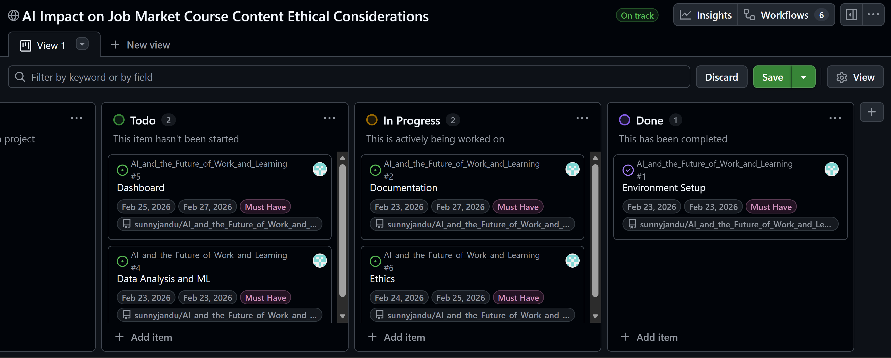
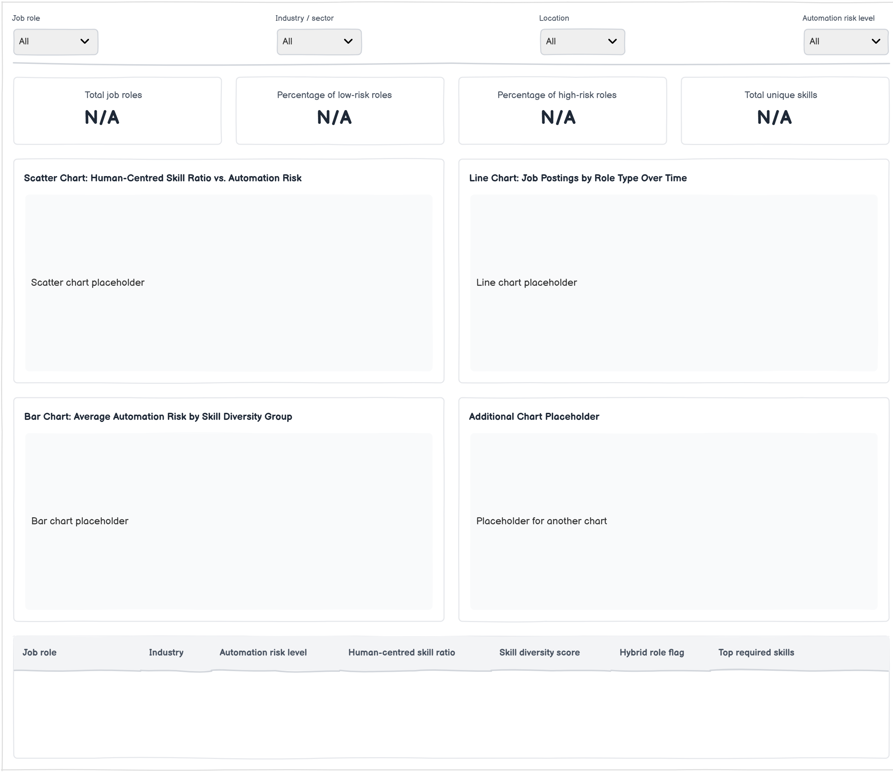
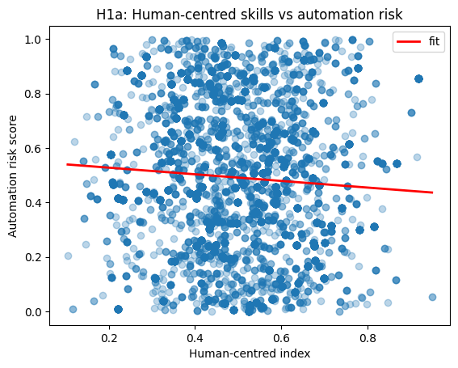
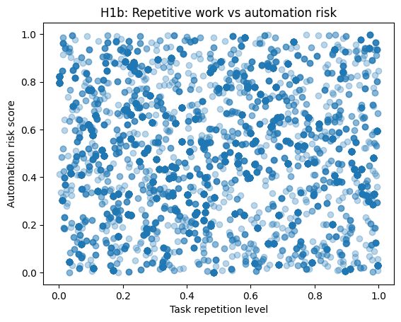
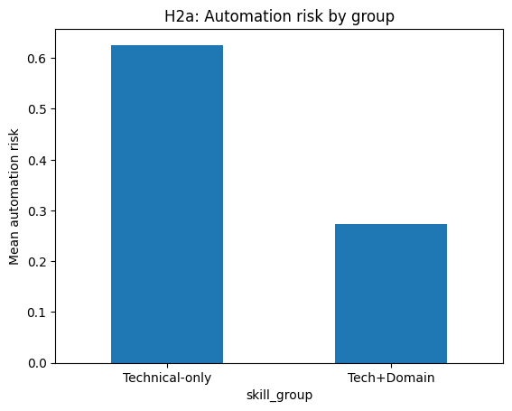
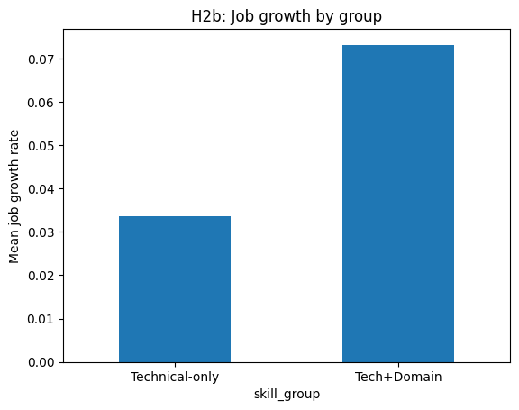
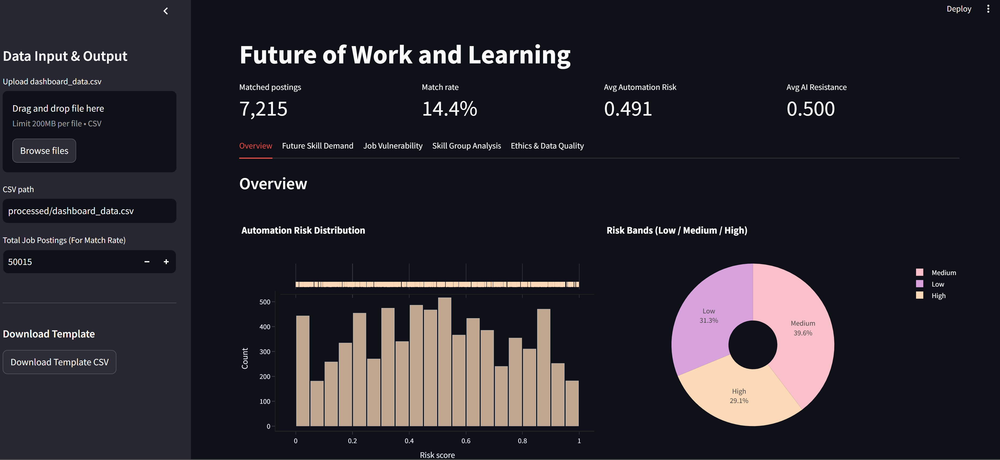

# 

# AI and the Future of Work and Learning

Educational Institutions face increasing pressure to ensure that course content remains relevant in a labour market shaped by rapid advances in artificial intelligence and automation. To make informed decisions about curriculum design, institutions require evidence-based insights into which skills and job roles are most likely to change or decline, and which are expected to remain resilient.

This project uses the datasets from kaggle to support strategic decision-making in course content development, helping Institutions align teaching programmes more closely with future workforce needs.

## Business Requirements
1. Identify Future Skill Demands
- Determine which skills are most resistant to AI-driven automation.
- Highlight emerging skill areas that should be prioritised in course curricula.

2. Assess Job Vulnerability
- Identify job roles and career pathways that are at high, medium, or low risk of automation.
- Understand which types of roles graduates may be more or less prepared for.

3. Support Curriculum Review and Design
- Identify gaps in current course offerings relative to future job-market needs.

4. Guide Student Employability Strategy
- Support decisions on employability modules, digital skills training, and transferable skills.
- Advise students on skill development aligned with future careers.

5. Ensure Ethical and Responsible Use of Data

## Project Aim & Objectives 
To support Educational Institutions in making informed curriculum decisions by analysing how artificial intelligence is changing job roles and skill requirements in the global labour market.

The project objectives are to:
1. Analyse labour-market data to identify job roles and skills most affected by AI and automation.
2. Highlight roles and skills that are likely to decline, evolve, or remain resilient.
3. Use data visualisation to communicate workforce trends relevant to higher education.
4. Apply machine-learning techniques to predict future job demand and skill changes.
5. Develop an interactive dashboard to support evidence-based curriculum design.

## Dataset Content
I’m using the AI Impact on Jobs dataset from Kaggle. 
-  1.3M LinkedIn Jobs & Skills 2024 Dataset: [View Here](https://www.kaggle.com/datasets/asaniczka/1-3m-linkedin-jobs-and-skills-2024?utm_source=chatgpt.com) 
This dataset contains over 1.3 million job adverts collected from LinkedIn and published on Kaggle.
It shows job titles and the skills employers ask for in real job postings.

In this project, this dataset is used to understand which skills are in demand, which skills are often combined together, and which new or hybrid skills are becoming more important.

- AI Automation Risk by Job Role Dataset: [View Here](https://www.kaggle.com/datasets/khushikyad001/ai-automation-risk-by-job-role?utm_source=chatgpt.com) 
This dataset, shared on Kaggle, shows how likely different job roles are to be automated.
Each job role has a score or level that tells whether the role is at low, medium or high risk from AI and automation.

In this project, this dataset is used to understand which jobs are more vulnerable and which jobs are more resilient.

## Hypothesis and how to validate?

### Hypothesis 1: Human-centred Skills and Automation Risk

Job roles that require more human-centred skills (such as communication, creativity and problem-solving) have lower automation risk than roles based mainly on routine or repetitive tasks.

H1a: More human-centred skills -> LOWER automation risk
H1b: Repetitive tasks → HIGHER automation risk

Will validate using regression statistical method

### Hypothesis 2: Digital and Domain skills

Job roles that combine digital or AI skills with domain knowledge (such as healthcare, business, education or engineering) are growing faster than roles that require only technical skills or only non-technical skills.

H2a: Tech+Domain has LOWER automation risk than Technical-only
H2b: Tech+Domain has HIGHER growth than Technical-only

Will validate using regression statistical method 

## Project Plan

#### Phase 1 - Planning 
1. Create a GitHub repository
2. Create these folders:
data/
   raw/
   processed/
notebooks/
   etl.ipynb
   hypothsis.ipynb

3. README.md - Documenting the Process 
4. Project Kanban Board - To manage the project

#### Phase 2 - ETL 

1. Extract (load the datasets into Python - Pandas )

- Read the LinkedIn dataset
- Read the automation risk dataset
- Save as extract.py

2. Transform 

- Clean Data 
- Split the skills
- Duplictates 
- Aggregate data etc...

3. Load
- Load clean data for next phase

#### Phase 3 -Feature Engineering & EDA 
- Feature Engineering - Create viariables needed for hypothesis testing
- Descriptive Statistics 
- Correlation Matrix

#### Phase 4 – Testing Hypothesis

- Hypothesis 1: Human-centred Skills and Automation Risk
- Hypothesis 2: Hypothesis 2: Digital and Domain skills

#### Phase 4 – Build a Dashboard

Communicate results to institutions.
1. Extract & Load Data
2. Build your visuals - Implement Wireframe

#### Phase 5 - Build the data-driven prototype (ML)

-  Build a ML prototype

#### Phase 6 – Documentation
Final Report Must Include:

- Project Aims and Objective 
- Datasets
- ETL Process
- Hypothesis Results
- Dashboard Screenshots
- ML results
- Curriculum Recommendations
- Ethical Consideration 

## Rationale 
### Data Limitation
Only 14.4% of the 50,015 job postings could be matched to the automation-risk dataset. This means that all tests, models, and comparisons are based on a much smaller sample.

Because of this:
- The results may not fully represent the wider job market.
- Relationships may appear weaker than they actually are.

During the merging process, multiple job postings matched the same role. This created duplicate rows. The dataset was cleaned by removing duplicates using unique job links. This step is reported clearly to ensure transparency and accuracy.

### Hypothesis 1 – Human-Centred Skills and Automation Risk
The analysis examined whether jobs that require higher levels of human-centred skills, such as communication and creativity, are less exposed to automation risk.

A scatter plot was used to assess the relationship between human-centred skills and automation risk, as it allows all individual data points to be visualised and helps identify whether a linear relationship exists.

For H1a (human-centred skills vs. automation risk), a slight downward trend was observed. This suggests that roles requiring higher levels of human-centred skills tend to have marginally lower automation risk. However, the relationship was extremely weak. The very low R² value (0.004) indicates that human-centred skills explain only a very small proportion of the variation in automation risk.

For H1b (task repetition vs. automation risk), the scatter plot appeared flat and widely dispersed, with no visible pattern. This supports the statistical results, which showed that task repetition does not significantly predict automation risk.

#### Business Implications 
From a strategic point of view, the findings suggest that simply placing more emphasis on general “human skills” may not be enough to significantly reduce graduates’ risk of being affected by automation. Although communication and creativity are still important, they should not be seen as the only protection against automation.

In terms of curriculum design, this means that human-centred skills should be taught alongside technical and subject-specific knowledge, rather than as separate courses. Employability strategies should focus on developing collaboration, problem-solving, and creativity within each discipline so that these skills are more relevant to the labour market.

### Hypothesis 2 – Digital and Domain Skills

The second analysis compared roles that combine technical and domain expertise (Tech+Domain) with roles that primarily require technical skills.

The comparison focused on two outcomes: automation risk and job growth. Bar charts were used to compare group averages, as they clearly display differences between categories and align with the t-test methodology applied in the statistical analysis.

For H2a (automation risk), a clear difference between the two groups was observed. Tech+Domain roles demonstrated lower average automation risk compared to technical-only roles. This visual difference aligns with the statistically significant result obtained from the hypothesis test.

For H2b (job growth), Tech + Domain roles show a higher average job growth rate than technical-only roles. However, this difference is not statistically significant (p = 0.292). Although the bar chart indicates a visual difference between the groups, the statistical test suggests that this variation may be due to chance. Therefore, there is insufficient evidence to conclude that combining technical and domain skills significantly influences projected job growth in this dataset.

#### Business Implications 
The results give useful guidance for curriculum planning. Although Tech + Domain roles do not show significantly higher job growth, they are linked to much lower automation risk. This suggests that these roles may offer better long-term stability.

For future skill planning, this means that interdisciplinary programmes, which combine digital or technical skills with sector-specific knowledge may better prepare graduates for sustainable careers. Curriculum reviews should therefore focus on developing hybrid skill pathways, such as data and healthcare, AI and finance, or digital skills and sustainability.

From an employability perspective, students should be encouraged to build subject expertise alongside their technical skills. This approach may help strengthen long-term career stability, even if short-term job growth differences are not statistically significant.

### Machine Learning Prototype
To test whether automation risk can be predicted using selected skill variables.
Instead of showing visuals, the model performance metrics (R² and RMSE) were reported.

ML results
- R^2 : 0.01
- RMSE: 0.266 

This means:
 - The model explains only a small part of the variation.
- The model is not suitable for real-world prediction.
- It is included as a proof of concept only.

#### Business Implications 
The low predictive accuracy suggests that automation risk is affected by many structural and job-related factors, not just the selected skill variables. For institutional decision-making, this means that simple prediction tools based only on skill demand may not be enough to accurately forecast job vulnerability.

Instead, a broader strategic approach, including industry trends, technological change, job structures, and employer demand would provide a stronger basis for curriculum planning and employability strategies.

## Analysis techniques used
The project used:
- Descriptive statistics
- Regression analysis
- Hypothesis testing
- A simple machine-learning prototype

Descriptive statistics were used to:
- Summarise automation risk, human-centred skills, and job growth
- Understand data distribution
- Support exploratory data analysis

To test Hypothesis 1:
- Ordinary Least Squares (OLS) regression was used

To test Hypothesis 2:
- Independent samples t-tests were used

A simple linear regression model was used as:
- A machine-learning prototype

## Ethical considerations
This project uses two publicly available datasets from Kaggle:

- A LinkedIn job postings and skills dataset
- An AI automation risk dataset by job role

Both datasets contain aggregated information about occupations and skills. They do not include personal names, contact details, demographic information, or any directly identifiable personal data. Therefore, the project does not process special category data or identifiable personal information.

This section examines privacy, governance, legal, and social implications in the UK context.

#### Data Privacy and Governance
The datasets do not contain personal data. The project follows UK GDPR principles by using only necessary data, keeping it secure, and analysing it at an aggregated level. No individuals or employers are identified.

#### Platform Bias and Representation
The LinkedIn dataset may not represent the whole labour market. It may underrepresent small businesses, informal jobs, and some regions, while overrepresenting digital and professional roles. This means conclusions should be cautious and not overgeneralised.

#### Modelling Assumptions and Algorithmic Ethics
Automation risk scores are based on research models and assumptions, not direct measurement. These scores are estimates and may reflect bias. The project treats them carefully and avoids presenting them as certain predictions.

#### Legal Implications (UK Context)
Because the data is anonymised and publicly available, it does not raise major legal issues under UK GDPR. The project does not involve automated decisions about individuals. 

#### Social Implications
Describing jobs as “high automation risk” could cause concern or discourage certain career choices. Automation often changes jobs rather than removes them completely. Curriculum decisions should not rely only on automation data.

#### Responsible and Compliant Practice
The project uses anonymised data, reports limitations clearly, avoids profiling individuals, and interprets results carefully. The main ethical risk is not privacy but misinterpretation or overgeneralisation of findings.

## Dashboard Design
Below is a simple explanation of each section of the dashboard, how it was designed, and what it includes.

#### 1. Overview tab
Give a quick summary of automation risk across all job roles. It shows simple charts so users can quickly understand the overall situation before looking at detailed analysis.

**Includes:**
* A histogram showing automation risk scores
* A breakdown of risk levels (Low, Medium, High)
* Clear explanations of how risk levels are defined

#### 2. Future Skill Demand
Identify roles that are more likely to remain in demand and resist automation. Roles are ranked using an AI-resistance score. This score combines:

* Human-centred skills
* Low task repetition
* Lower automation risk

The goal was to create a clear and understandable measure of resilience.

**Includes:**
* A bar chart ranking roles by AI-resistance
* Supporting metrics (number of postings, average risk, human skill index)
* A clear explanation of how the resistance score is calculated

#### 3. Job Vulnerability
Compare roles based on both automation risk and resilience. A scatter plot is used to show automation risk on one axis and AI-resistance on the other. Bubble size represents job demand.

This allows users to compare multiple factors at the same time.

**Includes:**
* Scatter plot (Automation Risk vs AI-Resistance)
* Role-level summaries
* Risk band classification
* A supporting data table

#### 4. Technical+Domain vs Technical-only
Compare hybrid roles (Technical + Domain skills) with technical-only roles. Roles are grouped based on skill type. The analysis compares differences in automation risk and job growth.

**Includes:**
* Average automation risk by skill group
* Average job growth comparison
* Statistical testing (Welch’s t-test)
* Display of t-statistics and p-values

#### 5. Ethics & Data Quality
Promote responsible and transparent use of the dashboard.

**Includes:**
* Ethical use statement
* Missing data analysis
* Dataset preview and export options

#### Data Input and Key Metrics

Users can:

* Upload a CSV dataset
* Use a default dataset
* Download a template to follow the correct structure

Before analysis begins, the dashboard checks that required columns and correct data types are present. This prevents errors and ensures consistency.

At the top of the dashboard, summary metrics give a quick overview:

* **Matched postings** – Number of valid postings used in analysis
* **Match rate** – Percentage of usable postings
* **Average automation risk** – Mean risk score
* **Average AI-resistance score** – Mean resilience score

These KPIs provide quick insight before detailed exploration.

#### Data Output and Transparency

The dashboard also allows users to:

* View processed data tables
* See missing value reports
* Download the cleaned dataset

This supports transparency, traceability, and responsible interpretation.

**The published dashboard can be found here: https://future-of-work-and-learning-fbc134616425.herokuapp.com/**

## Deployment 
#### Guide on Deployement
Prepared the project for deployment:
- Ensuring the Streamlit script was named app.py.
- Confirmed the project had a requirements.txt file listing packages needed to run the app.
- Ensuring the setup.sh and Procfile are created.
- Created a new app in Heroku.
- Connected the Heroku app to the GitHub repository.
- Committed changes to the repository and deployed through Heroku.
- Tested the live app and fixed any errors shown in the Heroku logs.

#### Challenges

1) Slug size too large
- Issue: Heroku warning: Your slug size (455 MB) exceeds our soft limit (300 MB) which may affect boot time.
- Impact: Increased build and boot time, risk of performance issues.
- Solution: Removed unnecessary libraries from requirements.txt so only essential dependencies were installed, reducing slug size.

2) App file location
- Issue: Heroku could not run the app correctly when app.py was not in the expected main directory.
- Solution: Restructured the repository so app.py was placed in the main project folder (root directory) used by the deployment process.

3) Local file path not working in deployment
- Issue: The app initially used a full local file path (Windows path), which does not exist in Heroku’s container.
- Solution: Updated the code to use repository-relative paths (e.g., processed/dashboard_data.csv) so the dataset could be accessed in the deployed environment.

## Development roadmap
The project followed an iterative development process that was shaped by technical limitations and data quality issues.

An early technical problem occurred when attempting to commit the full LinkedIn job postings dataset, which contained over one million records. Due to repository size and storage limits, the repository had to be recreated after several failed commit attempts. To solve this problem, the dataset was reduced to approximately 50,000 job postings before analysis began.

This smaller dataset allowed for stable version control and faster local processing, but it also affected later stages of analysis. In particular, reducing the dataset limited the number of job postings that could be matched with the automation risk dataset. This weakened the statistical reliability of the hypothesis testing. As a result, parts of the analytical approach were adjusted, including the grouping method used in Hypothesis 2.

The development process moved through several stages: setting up the repository and importing the data, identifying storage and version control limitations, reducing the dataset, cleaning and matching the data, carrying out feature engineering and hypothesis testing, developing and refining the dashboard, and completing documentation.

Overall, this roadmap demonstrates the need to balance practical computing limitations with careful and rigorous analysis throughout the project.

## Main data analysis libraries
Python Libraries Used:
- Pandas: Data loading, cleaning, merging and feature engineering.
- NumPy: Used to support numerical operations and missing value handling.
- SciPy: To conduct statistical hypothesis testing.
- Statsmodels: Used to estimate linear regression models for Hypothesis.
- Scikit-learn: Used to build a simple predictive prototype model.
- Streamlit – Web app framework (UI, layout, interactivity)
- Plotly.express – Interactive visualizations
- Os – File path checks 

## Credits & Content
The datasets used in this project were obtained from Kaggle:
- LinkedIn Jobs and Skills Dataset (2024), Kaggle
- AI Automation Risk by Job Role Dataset, Kaggle

Generative AI tools (ChatGPT, Github Chat) were used for:
- Ideas and brainstorming
- Support in data analysis workflow coding to achieve the desired results
- EDA & hypothesthis testing choices and explanations.
- Streamlit app code support  

## Media
- No external images, photographs or multimedia assets were used in this project.
- Dashboard wireframe - created using balsamiq
- Kanband snapshot - Github Kanban board 
- Dashboard Snapshot 

## Acknowledgements 
I would like to express my gratitude to my facilitator and cohorts for support throughout this project.